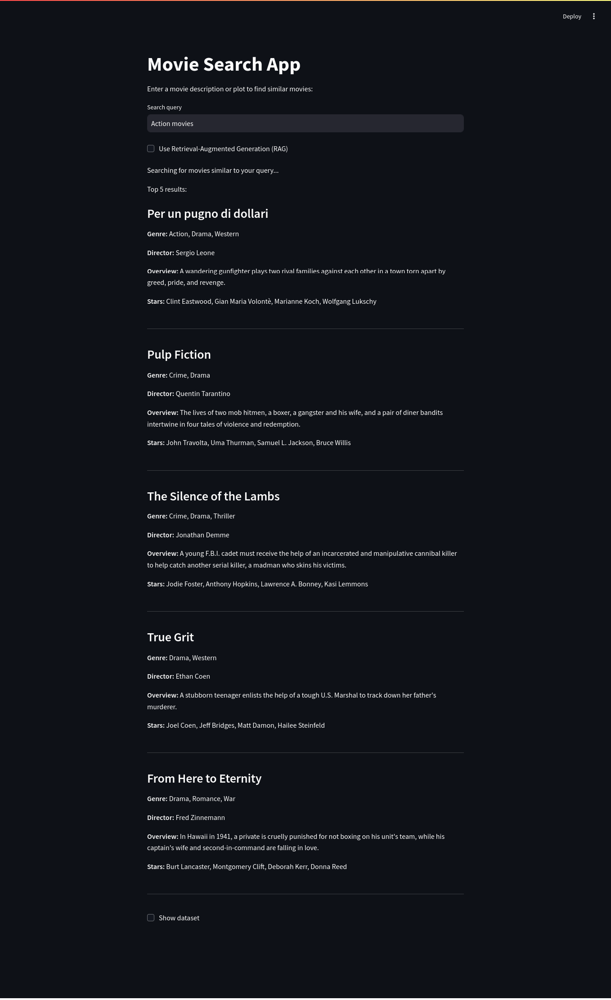

# **Movie Search**

Welcome to the **Movie Search** project! This application leverages **FAISS** for high-speed similarity search and combines it with **Retrieval-Augmented Generation (RAG)**. With a focus on improving **contextual understanding** through **semantic search**, the app provides more accurate and insightful movie recommendations.

## **Table of Contents**
- [Features](#features)
- [Improvements through Contextual Understanding](#improvements-through-contextual-understanding)
- [Requirements](#requirements)
- [How to Get Started](#how-to-get-started)
- [Screenshots](#screenshots)

## **Features**
- **Semantic Search**: Enter movie descriptions, titles, or genres and find contextually similar movies using **FAISS** for fast vector-based search.
- **Improved Retrieval-Augmented Generation (RAG)**: With the **Google Gemini API**, the app generates enhanced, context-rich responses to user queries.
- **Fast Search**: Using **FAISS**, the system ensures fast and efficient retrieval from large datasets.
- **User-Friendly UI**: A clean and intuitive **Streamlit** interface for easy interaction.

## **Improvements through Contextual Understanding**
This project improves the traditional **Retrieval-Augmented Generation (RAG)** framework by enhancing its ability to understand the **context** of user queries. By integrating **semantic search** with **Google Gemini**, the app now delivers:

1. **Deeper Contextual Insights**: The system better captures the meaning behind user inputs, enabling it to retrieve and generate more relevant movie suggestions based on semantic similarity rather than simple keyword matches.
2. **Enhanced RAG Mechanism**: Instead of just retrieving similar results, the app leverages **Google Gemini's generative capabilities** to create responses that are aligned with the user's intent, offering more insightful results with meaningful connections to the query.
3. **Natural Language Generation**: The RAG model produces high-quality, natural language descriptions of movies that reflect not only surface-level similarities but also deeper thematic or narrative connections.
4. **Advanced Semantic Matching**: Using **sentence embeddings** to represent movie descriptions, the system can capture complex relationships between movies, providing users with more accurate and context-aware recommendations.
5. **Scalable Search**: With the combination of **FAISS** for speed and **Google Gemini** for quality, this system scales effectively to handle large datasets while offering rich, contextualized search results.

## **Requirements**
Ensure you have the following installed:
- **Python 3.7+**
- **FAISS**: For efficient similarity search.
- **Streamlit**: To run the web application.
- **Sentence Transformers**: For generating embeddings.
- **Pandas and NumPy**: For data processing.
- **Google Gemini API Key**: For RAG-based contextual content generation.

## **How to Get Started**

### 1. **Clone the Repository**
```bash
git clone https://github.com/bereketo/semantic-search.git
cd semantic-search
```

### 2. **Set up virtual environment**
```bash
python3 -m venv venv
source venv/bin/activate
```
### 3. **Install required libraries**
```bash
pip install -r requirements.txt

```
## Screenshots



